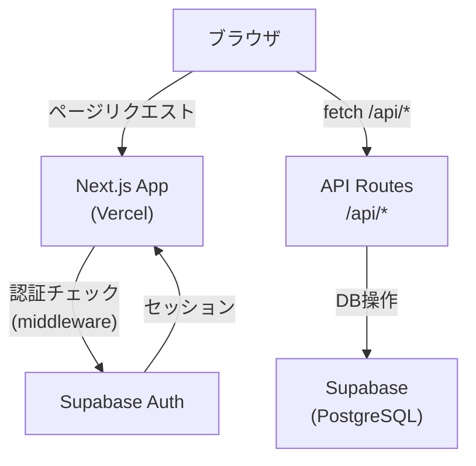
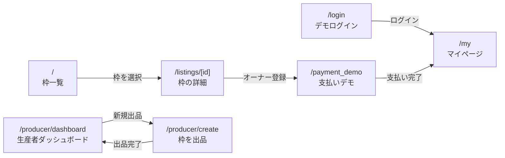
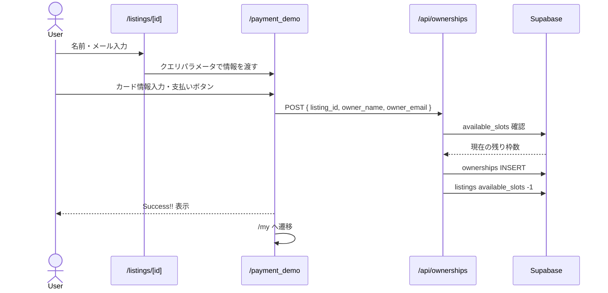
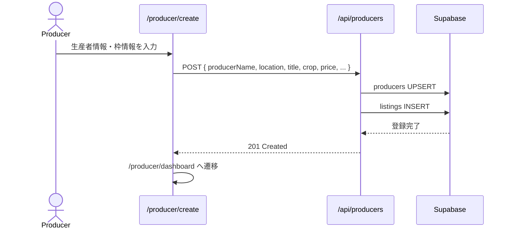
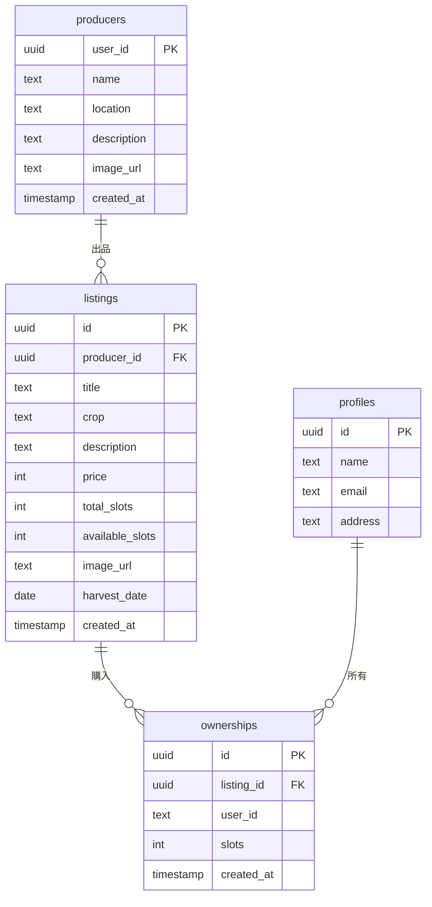
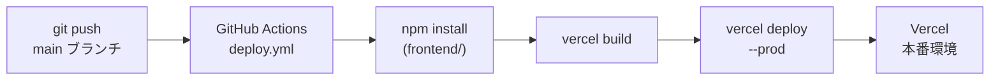

# AgriOwner — リポジトリ概要

農家・林業家が作物・木のオーナー枠をオンライン販売するプラットフォーム。購入者は育成過程を追跡し、収穫物を受け取ることができる。

---

## システム構成

- **フロントエンド・バックエンドともに Next.js** で一元管理（Vercel にデプロイ）
- バックエンドサーバーは存在せず、`/app/api/` 以下の API Routes が DB アクセスを担う
- DB・認証は **Supabase** に委譲

---

## ページ構成

---

## データフロー

### 枠購入フロー

### 枠出品フロー

---

## DB スキーマ

---

## API Routes

| メソッド | エンドポイント       | 説明                                       |
| -------- | -------------------- | ------------------------------------------ |
| GET      | `/api/listings`      | 枠一覧（`?producer_id=` で生産者絞り込み） |
| GET      | `/api/listings/[id]` | 枠の詳細（producers 結合）                 |
| GET      | `/api/ownerships`    | 所有枠一覧（`?email=` 必須）               |
| POST     | `/api/ownerships`    | 枠を購入・available_slots を -1            |
| GET      | `/api/producers`     | 生産者一覧                                 |
| POST     | `/api/producers`     | 生産者 + 枠を同時作成                      |

---

## デプロイフロー

- PR 時はプレビューデプロイ、`main` マージ時は本番デプロイ
- 環境変数（`NEXT_PUBLIC_SUPABASE_URL` 等）は GitHub Secrets → Vercel 経由で注入

---

## 技術スタック

| 領域           | 技術                    |
| -------------- | ----------------------- |
| フレームワーク | Next.js 16 (App Router) |
| 言語           | TypeScript              |
| スタイリング   | Tailwind CSS v4         |
| DB / 認証      | Supabase (PostgreSQL)   |
| デプロイ       | Vercel + GitHub Actions |
